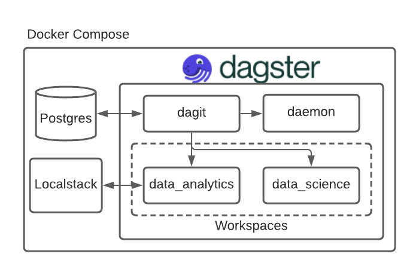

# Madison Big Data Meetup Jan 2022

# Overview
Repo to accompany my Big Data Meetup talk ([slides](https://docs.google.com/presentation/d/1Wpv3iAYp_7NBD9ya1wZyavkuFr1eZIkeRwu8qhZFBxs/edit?usp=sharing)) on [Dagster](https://dagster.io/). All the demos in the project can be run locally using this repo. This is not exhaustive of everything you can accomplish with Dagster but wanted to demonstrate some of the main abstractions of the framework.

### Architecture
Dagster can be [deployed](https://docs.dagster.io/deployment/overview) in a number of ways and environments (k8s, ECS...). For this example we are using Docker. All together this will spin up 6 containers: dagit (UI), dagster daemon, 2 Dagster workspaces (user code), postgres (metadata store) and localstack (which is not directly part of Dagster but used to show how Dagster can interact with an external system)



### Workspaces and Jobs
There are two main workspaces `data_analytics` and `data_science`. Each of these workspaces has their own dependencies and Dagster jobs. Within the directory for each workspace there is a `repo.py` which contains all the pipelines, schedules and sensors for the workspace and a `requirements.txt` for any additional python dependencies specific to that workspace. Note this is not the only way to layout resources. Each workspace can exist as a dedicated Github repo.

| Workspace | Pipeline | Description | Concepts |
| --- | --- | --- | --- |
| data_analytics | bmi | Calcuate BMI | op, graph, job, schedule, sensor |
| data_analytics | etl | Load data from one system into another |  resource, config, asset |
| data_science | simple | Simple dummy job | additional workspace and depedency isolation |

### Quick Start
Assumes you have [Docker](https://www.docker.com/) running on your machine. To start up the project do the following:

1. `make start-detached`
2. Access dagit: [http://localhost:3000/](http://localhost:3000/)

The `Makefile` also has some handy commands for running formatting (`make fmt`) and running tests for the two workspaces (`make test-data-science` and `make test-data-analytics`).

#### Sensor
If you want to experiment and try out the sensor. Enter the `localstack` container:
```
docker exec -it {localstack container id} /bin/bash
```

Create and upload a file to the localstack s3 bucket `dagster` in the `sensor` prefix (doesn't matter what the content is).
```
touch test.txt
aws s3 cp test.txt s3://dagster/sensor/test.txt --endpoint-url http://host.docker.internal:4566
```